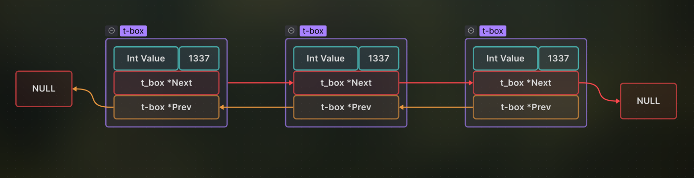

# The Push Swap 42-1337 Project.

This is my detailed log on how i implemented the push swap algorithm.

## Data Structure ( Stack_Nodes ) :

First I'm gonna need a method or a variable to store my data in a manner that will be easy and efficient to manipulate and change on command.\

I'm gonna use for this A Doubly Linked List :

it is in simple words a structure that is self referential in two directions, (it can point to the same type of itself).

so we can access the previous node and the next node.

## Processing Input (From Command Line) :

## 